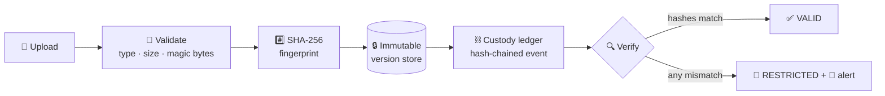
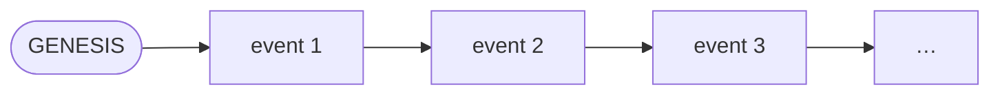

<div align="center">

# 🛡️ DOCSPECTOR


[](https://sih.gov.in)
[](#)
[](#)

[](https://github.com/ekupekuAI/docspector/actions/workflows/ci.yml)
[](backend/tests)
[](../../releases/latest)
[](../../releases/latest)
[](#-trust-model)

### A digital evidence file changed hands five times before it reached court.<br/>Can you prove nobody touched it? **Docspector can.**

<br/>

[](../../releases/latest/download/Docspector-windows-x64.exe)
[](../../releases/latest/download/Docspector-linux-x64)
[](../../releases/latest/download/Docspector-macos-arm64)

**One file. Double-click. Browser opens. Done.**<br/>
No Python. No Node. No installer. No internet. Demo case and users come pre-seeded.

</div>

---

## ⚡ 60-second tour

| # | Do this | Watch this happen |
|---|---------|-------------------|
| 1 | Log in as `docspector.io` (Investigating Officer) | Role-scoped workstation loads |
| 2 | Open case `HYD-CYB-2026-0147`, upload a PDF | SHA-256 fingerprint + `DOCUMENT_INGESTED` ledger event |
| 3 | Request transfer to the Legal Reviewer | Reviewer stays **locked out** while pending |
| 4 | Switch to `docspector.so` (account menu) and approve | Access granted for **that exact version only** |
| 5 | Hit **Simulate Cyber Attack** (demo mode) | Bytes on disk get silently flipped |
| 6 | Run **Verify** | ❌ Hash mismatch → version `RESTRICTED` → alert raised |
| 7 | Open the custody timeline | The full chain — with the broken link exposed |

Demo logins: `docspector.io` · `docspector.so` · `docspector.legal` · `docspector.auditor` — no passwords, all data synthetic.

## 🔁 How it works



Every custody event seals the hash of the event before it — starting from `GENESIS`. Edit, delete, or reorder anything and every later link shatters:



Versions are **append-only**: a new upload never overwrites the old one, so “which version did the reviewer actually see?” always has one answer.

## 👮 Who can do what

| Capability | IO | SO | Legal Reviewer | Auditor |
|---|:---:|:---:|:---:|:---:|
| View assigned cases | ✅ | ✅ | ✅ | ✅ |
| Upload versions | ✅ | ❌ | ❌ | ❌ |
| Request transfer | ✅ | ✅ | ❌ | ❌ |
| Approve / revoke transfer | ❌ | ✅ | ❌ | ❌ |
| Download content | ✅ | ✅ | approved version only | ❌ |
| Verify integrity | ✅ | ✅ | approved version only | ✅ |
| Review alerts | ❌ | ✅ | ❌ | read-only |

Deny-by-default. Every rule above is enforced in the **backend** — the UI is never the security boundary.

## 🧰 Stack

<div align="center">


React 18 · TypeScript · Vite · Tailwind CSS &nbsp;|&nbsp; FastAPI · Pydantic v2 · SQLAlchemy 2.0 · Alembic &nbsp;|&nbsp; single-file builds via PyInstaller + CI

</div>

## 🔒 Hardening that's actually tested

**372 automated tests** cover the parts that matter: RBAC and object-level authorization attacks, JWT tampering, hash-chain forgery (edits, deletions, forks, duplicate sequences), upload races, oversized/masquerading files, crash-safe upload cleanup, and a consistent API error contract with request IDs. Rate-limited login, security headers, and a 25 MB streaming cap round it out.

```bash
cd backend && pytest       # run them yourself
```

## 🖥️ Run from source

<details>
<summary><b>Development setup</b> (Python 3.10+ · Node 18+)</summary>

```bash
# backend
cd backend
python -m venv .venv
.venv\Scripts\activate            # Windows — Linux/macOS: source .venv/bin/activate
pip install -r requirements.txt
alembic upgrade head
python scripts/seed_demo.py
uvicorn app.main:app --reload     # http://127.0.0.1:8000

# frontend (second terminal)
cd frontend
npm ci
npm run dev                       # http://localhost:5173
```

Prefer one process? Build the UI once (`npm run build`), then `python backend/desktop.py` serves app + API together.

</details>

<details>
<summary><b>Build the single-file executable</b></summary>

```bash
python scripts/build_desktop.py   # → backend/dist/Docspector(.exe)
```

Pushing a `v*` tag makes GitHub Actions build, smoke-test, and publish binaries for all three platforms automatically.

</details>

## ⚖️ Trust model

Docspector gives you **application-level tamper evidence** for a local / intranet / air-gapped deployment. It deliberately does **not** claim to: prove a document is truthful, decide legal admissibility, provide absolute immutability, or survive a fully privileged host admin rewriting files and database together. Identities are synthetic demo accounts (mock JWT) — institutional identity integration is out of MVP scope. Stated limits are part of the design: an integrity tool that oversells itself is worthless in front of a court.

## 📚 Documentation

| | |
|---|---|
| 📕 [Product Requirements (PRD)](docs/Docspector_PRD.docx) | 🎯 [Threat model](docs/THREAT_MODEL.md) |
| 🧾 [API error contract](docs/API_ERROR_CONTRACT.md) | 🔗 [Requirement → test traceability](docs/TRACEABILITY.md) |
| ⚠️ [Demo limitations](docs/DEMO_LIMITATIONS.md) | ⚙️ [Backend internals](backend/README.md) |

---

<div align="center">

**Built for Smart India Hackathon 2026 · Problem Statement SIH26190 · Ministry of Home Affairs**

Synthetic data only · [License](LICENSE)

</div>
